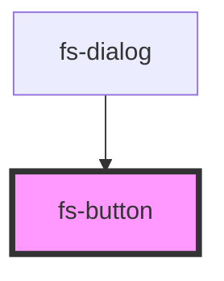

# fs-button

<!-- Auto Generated Below -->

## Properties

| Property       | Attribute       | Description | Type                                                        | Default       |
| -------------- | --------------- | ----------- | ----------------------------------------------------------- | ------------- |
| `class`        | `class`         |             | `string`                                                    | `undefined`   |
| `disabled`     | `disabled`      |             | `boolean`                                                   | `undefined`   |
| `iconPosition` | `icon-position` |             | `"left" \| "right"`                                         | `'left'`      |
| `loading`      | `loading`       |             | `boolean`                                                   | `undefined`   |
| `size`         | `size`          |             | `"default" \| "large" \| "middle" \| "small"`               | `'middle'`    |
| `type`         | `type`          |             | `"default" \| "flat" \| "link" \| "primary" \| "secondary"` | `'secondary'` |

## Shadow Parts

| Part        | Description |
| ----------- | ----------- |
| `"bg"`      |             |
| `"content"` |             |
| `"icon"`    |             |
| `"spinner"` |             |

## Dependencies

### Used by

 - [fs-dialog](../fs-dialog)

### Graph

----------------------------------------------

*Built with [StencilJS](https://stenciljs.com/)*
